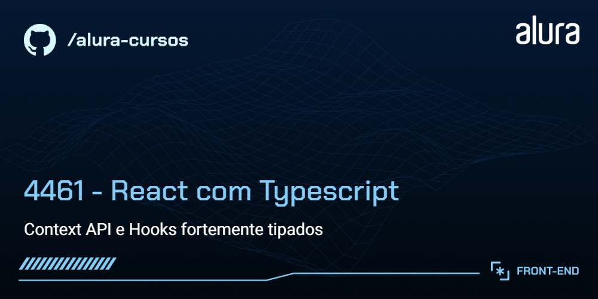
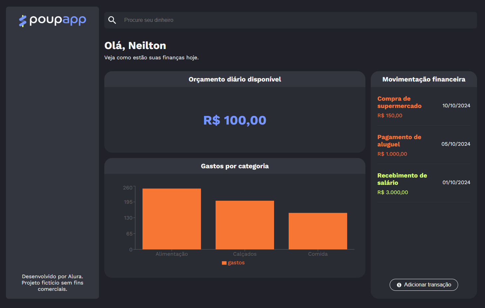

# 💰 PoupApp

O PoupApp é uma plataforma de gerenciamento financeiro voltada para ajudar usuários a organizar suas finanças. Focado na simplicidade, o PoupApp permite que os usuários acompanhem seus gastos, definam metas financeiras e visualizem seu progresso através de gráficos dinâmicos. 

Com funcionalidades que incentivam o controle de despesas e a organização do orçamento diário, o PoupApp se torna o parceiro ideal para quem busca saúde financeira e realização de objetivos pessoais.

<p align="center">
  
</p>

## 🔨 Funcionalidades do projeto

O PoupApp oferece as seguintes funcionalidades:

- Acompanhar o orçamento diário e manter o controle das suas despesas.
- Realizar transações de maneira prática, adicionando despesas e receitas.
- Analisar seus gastos por meio de gráficos dinâmicos, categorizando as despesas para melhor entendimento.

## ✔️ Técnicas e tecnologias utilizadas

O projeto foi desenvolvido utilizando as seguintes tecnologias:

- `Typescript` - Linguagem que adiciona tipagem estática ao JavaScript.
- `React.js` - Biblioteca para construção de interfaces dinâmicas.
- `Vite` - Ferramenta de construção rápida para desenvolvimento com JavaScript moderno.
- `Styled-components` - Para estilização de componentes com CSS-in-JS.
- `Context API` - Gerenciamento de estado de forma reativa.
- `React Router` - Para navegação entre páginas da aplicação.
- `Recharts` - Para criação e visualização de gráficos.
- `Figma` - Para prototipagem e design visual do projeto.

E outras dependências e ferramentas auxiliares.

## 🛠️ Abrir e rodar o projeto

Para rodar o projeto em sua máquina local, siga estes passos:

1. Baixe o repositório do projeto para o seu computador.

2. Navegue até a pasta do projeto, extraia os arquivos e abra no seu editor de código favorito. 

3. Instale as dependências executando:

    ```bash
    npm install
    ```

4. Para iniciar o servidor de desenvolvimento, utilize o comando:

    ```bash
    npm run dev
    ```

5. O projeto estará disponível em http://localhost:5173.

## 📚 Mais informações do curso

Gostou do projeto e quer conhecer mais?

O design e protótipo deste projeto podem ser encontrados [aqui](https://www.figma.com/community/file/1468989433664551328). Este projeto é fictício e sem fins lucrativos. 

Aproveite o desenvolvimento e aprimoramento do PoupApp!